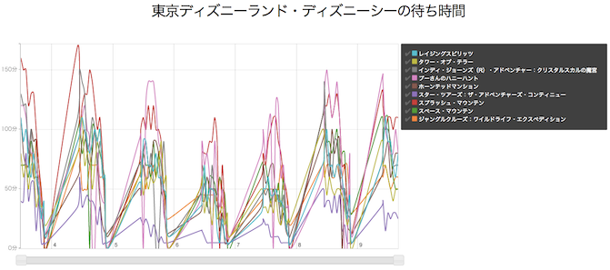

東京ディズニーランド・ディズニーシーの待ち時間グラフ
=============

東京ディズニーランドとディズニーシーの乗り物待ち時間を取得して、グラフするプロジェクト。

## 仕組み ##

`data_collector`はデータ収集ツール。[ディズニーランド](http://s.tokyodisneyresort.jp/tdl/atrc_list.htm])と[ディズニーシー](http://s.tokyodisneyresort.jp/tds/atrc_list.htm)の待ち時間ウェブサイトをダウンロードして、XSLTでCSV形式に変換する。

`www`は、[rickshaw.js](https://github.com/shutterstock/rickshaw)を利用して、CSVデータをグラフ化する。
